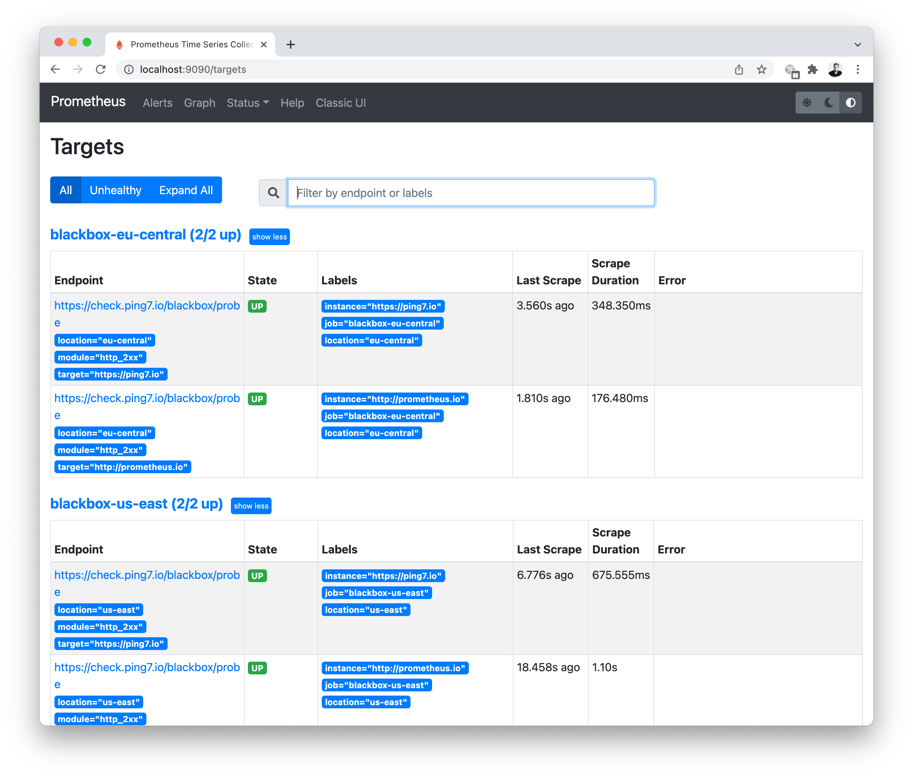

# 🐳 ping7.io Docker integration example

This example spins up a local Promtheus instance via
Docker and checks two statically confiugured websites.

## Dependencies

You need [Docker](https://www.docker.com/get-started) installed.
On a Mac, [Homebrew](https://brew.sh/) does the job:

```
$ brew install minikube helm k9s
```

Please clone this project or download and unzip the sources.

## Running this example project

1. Create a file named `ping7io-credentials` containing your ping7.io api token

```shell
$ echo "YOUR_API_TOKEN" > ping7io-credentials
```

2. Use `docker compose` to launch a local Prometheus instance

```shell
$ docker compose up
```

Now you can:

* Open Prometheus at [localhost:9090](http://localhost:9090)
* view the [configured Prometheus targets](http://localhost:9090/targets)
* query the [gathered metrics](http://localhost:9090/graph?g0.expr=probe_success&g0.tab=1&g0.stacked=0&g0.show_exemplars=0&g0.range_input=1h)
* analyze the [alarming rules](http://localhost:9090/alerts)




## Further reading

For detailed configuration options, head over to
[`docs.ping7.io`](https://docs.ping7.io)
