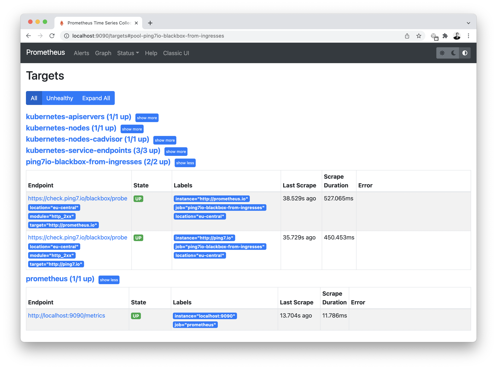

# 🎡 ping7.io Kubernetes integration example

This example spins up a local Minikube cluster, installs Prometheus
into the cluster and let ping7.io check all Ingresses defined in
the cluster.

> 🤓 As our cluster Minikube cluster is not publicly available on the
> internet, we're faking the ingress definitions. The HTTP host from
> our Kubernetes ingress definition is collected and checked against
> the ping7.io api.

## Dependencies

You need [Minikube](https://kubernetes.io/docs/tasks/tools/#minikube),
[Helm](https://helm.sh/docs/intro/install/#from-the-binary-releases)
and [Docker](https://www.docker.com/get-started) installed.
We also recommend to install [k9s](https://k9scli.io/) because it
makes working with Kubernetes that much easier.
On a Mac, [Homebrew](https://brew.sh/) does the job:

```
$ brew install minikube helm k9s
```

Please clone this project or download and unzip the sources.

## Running this example

1. Launch Minkube

```bash
$ minikube start
```

2. Create a Kubernetes secret for your ping7.io api token and store it in the cluster.

```
$ echo "YOUR_API_KEY" > ping7io-credentials
$ kubectl create secret generic ping7io-api-token \
  --from-file=./ping7io-token
```

3. Install Prometheus

> We use Helm for Prometheus installation. Then you do not have
> to edit raw Kubernetes YAMLs. And it just works.

```
$ helm repo add prometheus-community \
    https://prometheus-community.github.io/helm-charts
$ helm install ping7io-example \
    prometheus-community/prometheus \
    -f values.yaml
```
4. Create some Ingresses

> Besides Ingresses we deploy a default echoserver service to
> back the Ingress definition with a Service.

```
$ kubectl create deployment echoserver --image=k8s.gcr.io/echoserver:1.10
$ kubectl create -f example-ingresses/echoserver-svc.yaml
$ kubectl create -f example-ingresses/ping7.io.yaml
$ kubectl create -f example-ingresses/prometheus.io.yaml
```

5. Connect to the Prometheus UI

```
$ export POD_NAME=$(kubectl get pods --namespace default -l "app=prometheus,component=server" -o jsonpath="{.items[0].metadata.name}")
$ kubectl --namespace default port-forward $POD_NAME 9090
```

> Point your browser to [localhost:9090](http://localhost:9090/targets#pool-ping7io-blackbox-from-ingresses)
> to open the Prometheus UI.



## Shutting everything down

```
$ helm uninstall ping7io-example
$ minikube stop
$ minikube delete
```

## Further reading

For detailed configuration options, head over to
[`docs.ping7.io`](https://docs.ping7.io)
